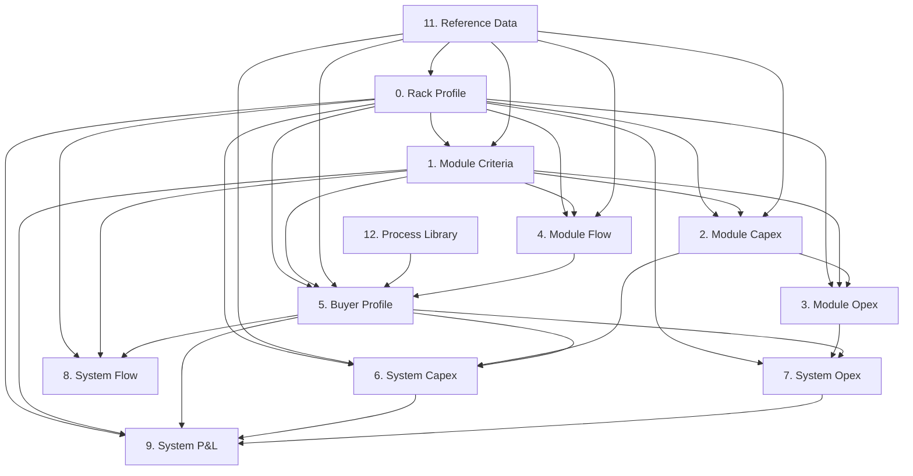

# Model Overview

Source workbook: `Tribe_model_20.1.26.xlsx`

This model is deterministic (no circular refs / solver). Data flows:

`0. Rack Profile` → `1. Module Criteria` → `2/3/4. Module Capex/Opex/Flow` → `5. Buyer Profile` → `6/7/8/9. System Capex/Opex/Flow/P&L`

## Sheet Inventory

| Sheet | Type | Yellow inputs | Formula cells | Depends on |
|---|---:|---:|---:|---|
| Overview | info | 1 | 0 | - |
| Agent Context | info | 0 | 0 | - |
| 0. Rack Profile | calc | 13 | 35 | 11. Reference Data |
| 1. Module Criteria | calc | 8 | 10 | 0. Rack Profile, 11. Reference Data |
| 2. Module Capex | calc | 1 | 46 | 0. Rack Profile, 1. Module Criteria, 11. Reference Data |
| 3. Module Opex | calc | 7 | 10 | 0. Rack Profile, 1. Module Criteria, 2. Module Capex |
| 4. Module Flow | calc | 5 | 20 | 0. Rack Profile, 1. Module Criteria, 11. Reference Data |
| 5. Buyer Profile | calc | 3 | 77 | 0. Rack Profile, 1. Module Criteria, 11. Reference Data, 12. Process Library, 4. Module Flow |
| 6. System Capex | calc | 1 | 31 | 0. Rack Profile, 11. Reference Data, 2. Module Capex, 5. Buyer Profile |
| 7. System Opex | calc | 1 | 22 | 0. Rack Profile, 3. Module Opex, 5. Buyer Profile |
| 8. System Flow | calc | 1 | 32 | 0. Rack Profile, 1. Module Criteria, 5. Buyer Profile |
| 9. System P&L | calc | 0 | 36 | 0. Rack Profile, 1. Module Criteria, 5. Buyer Profile, 6. System Capex, 7. System Opex |
| 11. Reference Data | reference | 79 | 12 | - |
| 12. Process Library | reference | 127 | 0 | - |

## Dependency Graph

## Key Inputs (Yellow Cells)

Only yellow cells that **feed calculations** (are referenced by at least one formula) are listed below.

### 0. Rack Profile
- `0. Rack Profile!B6` — Chipset type (default `NVIDIA H100`)
- `0. Rack Profile!B17` — Cooling method (default `Direct-to-Chip (DTC)`)
- `0. Rack Profile!B36` — Module IT capacity target (kW) (default `250`)
- `0. Rack Profile!B58` — Electricity price (£/kWh) (default `0.18`)
- `0. Rack Profile!B67` — Annual operating hours (default `8000`)

### 1. Module Criteria
- `1. Module Criteria!B6` — Compute rate (£/kW/month) (default `150`)
- `1. Module Criteria!B7` — Target utilisation rate (%) (default `0.9`)
- `1. Module Criteria!B15` — Heat pump enabled? (default `1`)
- `1. Module Criteria!B16` — Heat pump output temperature (°C) (default `90`)
- `1. Module Criteria!B23` — Hours per year (default `8760`)
- `1. Module Criteria!B27` — Base heat price - no HP (£/MWh) (default `25`)
- `1. Module Criteria!B28` — Premium heat price - with HP (£/MWh) (default `40`)

### 2. Module Capex
- `2. Module Capex!B52` — Heat pump CAPEX rate (£/kWth) (default `600`)

### 3. Module Opex
- `3. Module Opex!B5` — Electricity rate (£/kWh) (default `0.18`)
- `3. Module Opex!B15` — Base maintenance (% of base capex) (default `0.03`)
- `3. Module Opex!B17` — Heat pump maintenance (% of HP capex) (default `0.02`)
- `3. Module Opex!B19` — Insurance (% of total capex) (default `0.01`)
- `3. Module Opex!B24` — Site lease/licence (£/yr) (default `15000`)
- `3. Module Opex!B25` — Remote monitoring & NOC (£/yr) (default `12000`)
- `3. Module Opex!B26` — Connectivity & admin (£/yr) (default `8000`)

### 4. Module Flow
- `4. Module Flow!B5` — Specific heat of water (kJ/kg·K) (default `4.18`)
- `4. Module Flow!B6` — Water density (kg/L) (default `1`)
- `4. Module Flow!B11` — Source loop ΔT (°C) (default `=IF('0. Rack Profile'!B17="Direct-to-Chip (DTC)",'11. Reference Data'!E23,IF('0. Rack Profile'!B17="Single-Phase Immersion",'11. Reference Data'!E24,IF('0. Rack Profile'!B17="Two-Phase Immersion",'11. Reference Data'!E25,IF('0. Rack Profile'!B17="Rear Door Heat Exchanger",'11. Reference Data'!E26,'11. Reference Data'!E27))))`)
- `4. Module Flow!B21` — Sink loop ΔT (°C) (default `10`)
- `4. Module Flow!B29` — Design velocity (m/s) (default `2`)

### 5. Buyer Profile
- `5. Buyer Profile!B11` — Select process (default `Pasteurisation - Medium`)
- `5. Buyer Profile!B100` — Module footprint each (m²) (default `15`)

### 6. System Capex
- `6. System Capex!B25` — Shared infrastructure (%) (default `0.05`)

### 7. System Opex
- `7. System Opex!B21` — Shared overhead (%) (default `0.05`)

### 8. System Flow
- `8. System Flow!B40` — Design velocity (m/s) (default `2`)

### 11. Reference Data
- 79 adjustable reference values (see Phase 2 guide for exact ranges).

### 12. Process Library
- 127 adjustable reference values (see Phase 2 guide for exact ranges).

